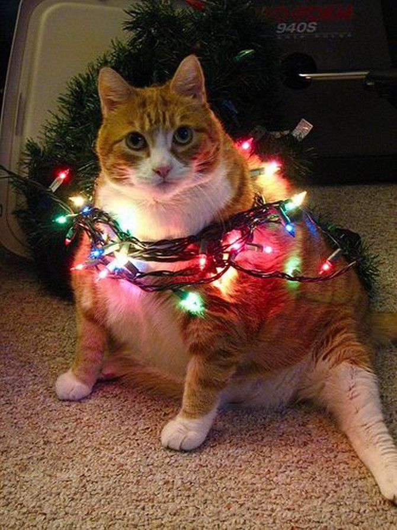

# Сайт про меня

*Меня зовут **Лиза**, мне 18 лет.  
Я люблю читать, рисовать, учиться.*

Я учусь на *прикладной информатике*, впринципе неплохо.

### У меня есть:
1. Кот
2. Ролики
3. Очки
   
Я очень люблю своего кота.  
На зимних каникулах я хочу уехать отдохнуть куда нибудь и прочитать много книг.

#### Мои любимые книги:
- Замок Кафка
- Сны Ктулху Лавкрафт
- Мат. анализ

Надо пополнить список любимых книг новыми.  
Поскольку скоро *Новый год* у меня очень новогоднее настроение. 
#### На этих каникулах я обязательно:
1. Сделаю пряничный домик
2. Посмотрю фильм Один дома
3. Покатаюсь на коньках
4. Наряжу ёлку
   
